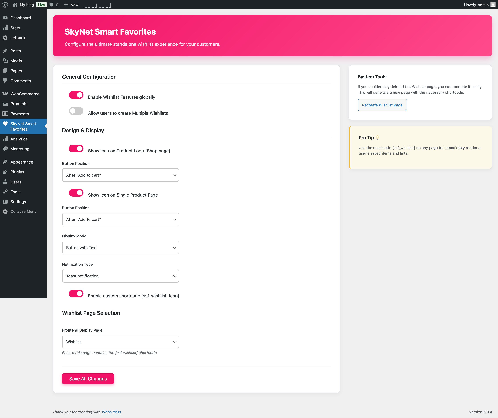
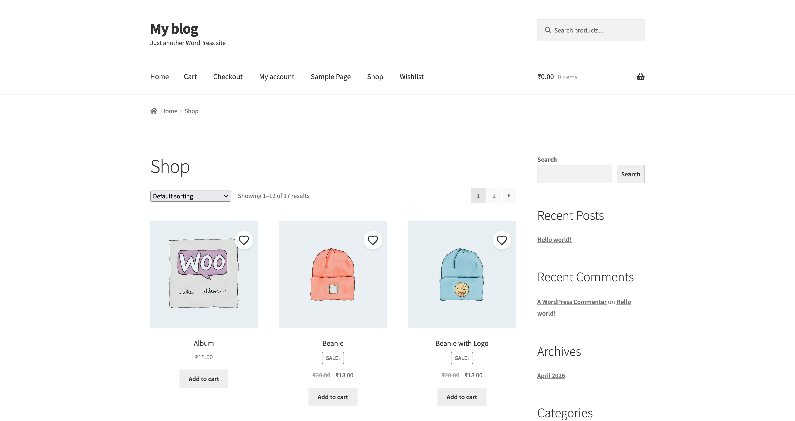
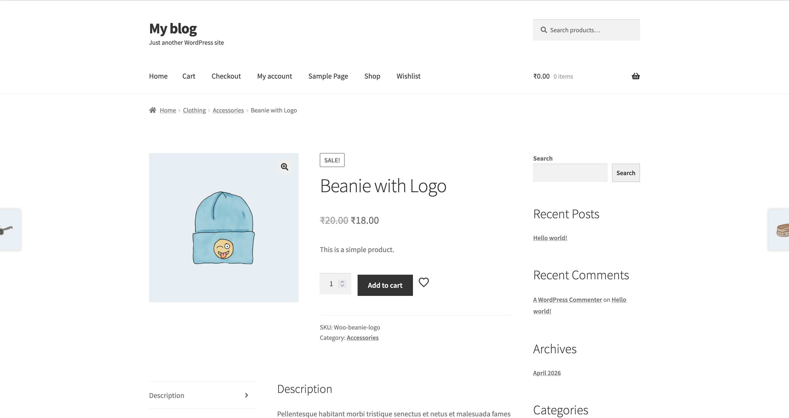
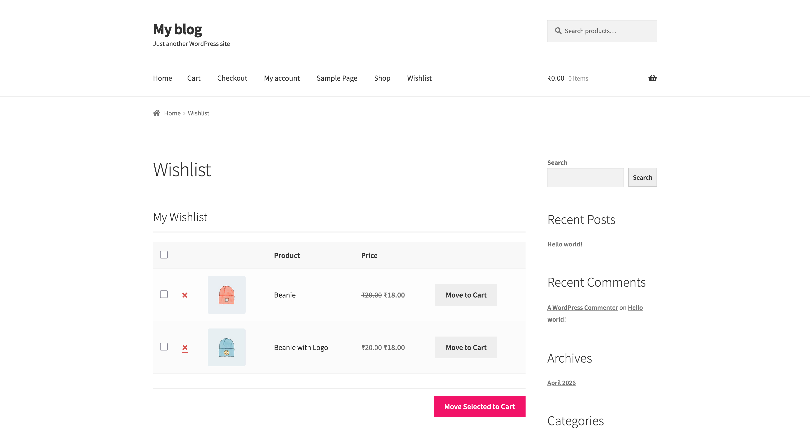

# SkyNet Smart Favorites

**Short Description:** Flexible WooCommerce wishlist support with multiple lists, guest session preservation, and fast move-to-cart actions.

SkyNet Smart Favorites adds a modern, streamlined wishlist experience to WooCommerce stores. Customers can save favorite products, manage multiple wishlists, and move items from their wishlist directly into the cart.

## Description

SkyNet Smart Favorites is designed to improve product discovery and boost conversions by giving customers an easy way to save and organize products for later.

Key features include:

- Multiple wishlist support for saved product collections.
- Guest session persistence so visitors keep wishlist items while browsing.
- One-click add/remove wishlist icons on shop and product pages.
- Move-to-cart functionality directly from the wishlist.
- Admin settings for display, notifications, and page selection.

The plugin works seamlessly with WooCommerce and provides a clean frontend experience for customers and a simple setup workflow for store owners.

## Installation

1. Upload the `SkyNet-Smart-Favorites` plugin folder to `/wp-content/plugins/`.
2. Activate the plugin from the WordPress Plugins screen.
3. Go to the **SkyNet Smart Favorites** admin menu.
4. Configure settings and verify the wishlist page is created.

## Frequently Asked Questions

### Can I use this without WooCommerce?

No. SkyNet Smart Favorites requires WooCommerce to be installed and active.

### Does the wishlist work for guest visitors?

Yes. Guest wishlist items are preserved in the WooCommerce session while visitors browse.

### Will wishlist items remain after login?

Yes. Wishlist session data is preserved and can be synced after users log in.

### How do I display the wishlist page?

Use the shortcode: `[skynsmfa_wishlist]`. You can also use `[skynsmfa_wishlist_icon product_id="123"]` to display an add/remove icon for a specific product.

## Screenshots

### 1. Settings Page

### 2. Shop Loop Button

### 3. Product Page Button

### 4. Wishlist Page

## Changelog

### 1.0.0

- Initial release.
- Added multiple wishlist support for WooCommerce.
- Added guest session wishlist persistence.
- Added shortcode-driven add/remove wishlist icons.
- Added move-to-cart wishlist actions.

## Support

For support and bug reports, use the plugin support forum on WordPress.org after publishing. Include your WooCommerce and WordPress versions and any relevant details.

## License

SkyNet Smart Favorites is released under the GPLv2 or later license.
